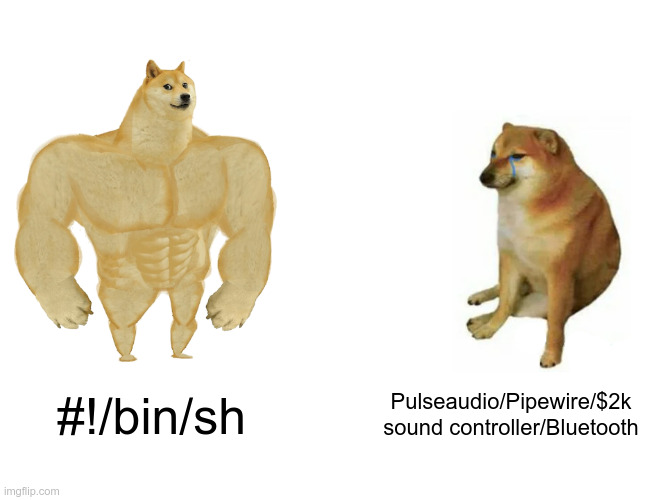

plebaudio
=========



plebaudio is a no-bullshit script demonstrating how to use a FIFO pipe
to stream data over UDP.

It is intended to be used as a sound server. For example, `mpv` is able
to output raw PCM audio using `--ao=pcm --ao-pcm-file=/some/fd`. We
can use this to our advantage and create a simple audio streaming
protocol.

Server-side, we can just run:

```
$ socat -b 2048 STDIO UDP-LISTEN:2115 | aplay
```

Locally, we can run `plebaudio` and then play something with `mpv`:

```
$ plebaudio my-sound-server:2115
$ mpv 'https://yewtu.be/watch?v=Mw__xMOkrRE' --ao=pcm --ao-pcm-file=/tmp/plebaudio.sock
```

Quit `plebaudio` with `^C`.

## License

GNU AGPL v3
